<!-- Perfil gerado a partir do design system do portfólio (miguelrsant.com.br). -->

<a href="https://miguelrsant.com.br/">
<picture>
  <source media="(prefers-color-scheme: dark)" srcset="assets/profile-dark.svg">
  <source media="(prefers-color-scheme: light)" srcset="assets/profile-light.svg">
  
</picture>
</a>

 

## Sobre mim

Sou desenvolvedor Full Stack em Franca/SP. Hoje trabalho com Python em sistemas ERP na Di Fiorenna Indústria Cosmética. Antes de programar, trabalhei com supply chain, então gosto de código que resolve problema real de operação: já levei relatórios de 3h30 para 25 s e uma suíte de testes de 10 min para 1,28 s.

## Projetos em destaque

| Projeto | O que é | Stack |
| --- | --- | --- |
| [desafio-backend](https://github.com/miguelrsant/desafio-backend) | API REST de tarefas com JWT, soft delete, camada de services e testes com cobertura | Django REST, PostgreSQL, Docker, Pytest |
| [desafio-frontend](https://github.com/miguelrsant/desafio-frontend) · [demo](https://desafio-frontend-ashen-omega.vercel.app) | Explorer da Rick and Morty API com busca, filtros, paginação e dark mode | React, TypeScript, Tailwind CSS |
| [atlasstore](https://github.com/miguelrsant/atlasstore) · [demo](https://atlasstore-dun.vercel.app) | Loja virtual de moda com foco em identidade visual e motion | React, TypeScript, Vite |
| [clone-tabnews](https://github.com/miguelrsant/clone-tabnews) · [demo](https://clone-tabnews-nine-kohl-63.vercel.app) | Implementação do TabNews feita no curso.dev | JavaScript, Next.js |
| [miguelrsant-ai-pack](https://github.com/miguelrsant/miguelrsant-ai-pack) | Skills, agentes, prompts e workflows reutilizáveis para programar com IA | JavaScript |

## Contato

[Portfólio](https://miguelrsant.com.br) · [LinkedIn](https://www.linkedin.com/in/miguelrsant) · [E-mail](mailto:miguelrsant01@gmail.com)
